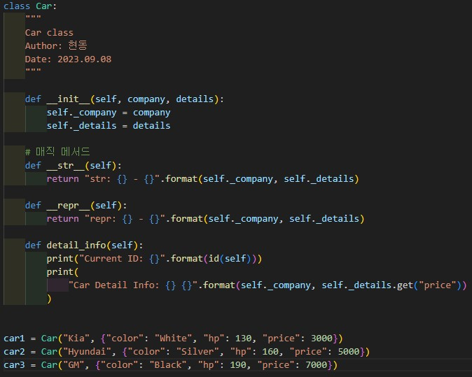

# 클래스와 메서드 심화

 

1. Magic method

   1. `self`

      - class를 기반으로 생성된 개별 instance들에게 자기 자신의 고유값을 할당하기 위한 class parameter(예약어)
      - 내부 method 구현을 통해 `print(id(self))`를 반환하도록 만들면 각 instance들의 id값이 나온다.

   2. `dir`

      - 해당 instance가 가지고 있는 모든 attribute들을 list형태로 보여주는 magic method

      - 상위로부터 상속받은것 까지 포괄적으로 나타냄

      - 개별 값은 나오지 않음

   3. `__dict__`

      - 해당 instance의 개별 namespace에 있는 attribute들을 dictionary형태로 보여주는 magic method
      - 세부 값이 나온다.

   4. `__doc__`

      - 해당 class의 주석을 출력해준다.

2. Name space

   - 아래와 같이 출력하면 각 id가 다르게 나온다.

   

   

   

   

   

   

   

   - 그렇다면 아래와 같이 출력하면 어떻게 될까?

   

   

   

   - 아래와 같이 같은 클래스를 사용중이라고 나온다.
     - main이라는 namespace에서 `Car` class를 공유하고 있다.

   

   

   

   - 그렇다면 id도 같아야 할 것이다.

   

   

   

   

   

   - 역시나 id도 같게 나온다.
     - class의 instance를 호출한 것이 아닌, instance를 만드는 원본의 주소를 호출했기 때문이다.

 
